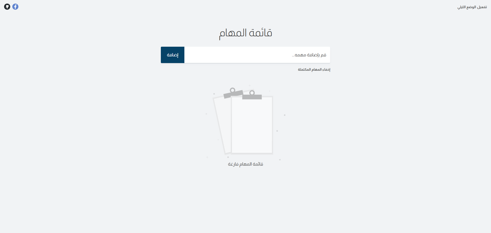
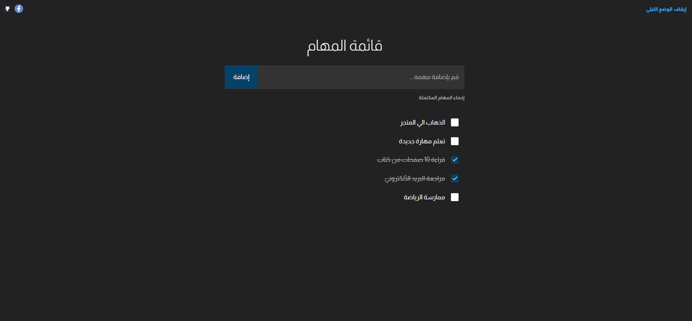

# 📋 To-Do List App

A simple, modern, and responsive **To-Do List application** built with **HTML, SCSS, and vanilla JavaScript**.
The app allows users to add, check, and delete tasks, with a clean UI and persistent storage.




---

## ✨ Features

* ✅ Add new tasks dynamically
* ✅ Mark tasks as complete using custom SVG checkboxes
* ✅ Delete tasks with confirmation prompt
* ✅ Responsive design & dark theme toggle
* ✅ Tasks saved in local storage (persist between sessions)
* ✅ “Empty list” message with illustration when no tasks exist

---

## 🌍 Live Demo

👉 [To-Do List App](https://oyoussef162.github.io/To-Do-List-App/)

---

## 📂 Project Structure

```
project-root/
│
├─ src/                     # Main source code
│   ├─ index.html           # Entry HTML file
│   ├─ scss/                # SCSS styles
│   ├─ js/                  # JavaScript modules
│   │   ├─ elements.js      # DOM selectors & utilities
│   │   ├─ eventListeners.js# Handlers for UI actions
│   │   ├─ main.js          # App entry point
│   │   └─ ...
│
├─ public/                  # Static assets (copied as-is to dist)
│   └─ assets/
│       ├─ icon-empty.svg
│       ├─ icon-checkmark.svg
│       ├─ facebook.svg
│       └─ ...
│
├─ dist/                    # Auto-generated build output
│
├─ package.json             # Dependencies & scripts
└─ README.md                # Project documentation
```

---

## 🚀 Getting Started

### 1. Clone the repo

```bash
git clone https://github.com/your-username/todo-list-app.git
cd todo-list-app
```

### 2. Install dependencies

```bash
npm install
```

### 3. Run locally (dev server)

```bash
npm run dev
```

### 4. Build for production

```bash
npm run build
npx serve dist
```

---

## 🛠️ Built With

* HTML5
* SCSS
* JavaScript (ES Modules)
* [Vite](https://vitejs.dev/) for build tooling

---

✍️ **Instructor**: [almdrasa.com](https://almdrasa.com/?srsltid=AfmBOoq3b5z-4WOFb2eGxPfihotnY_9o2R6RGIPozGjctbwVtn8OiY9u)
